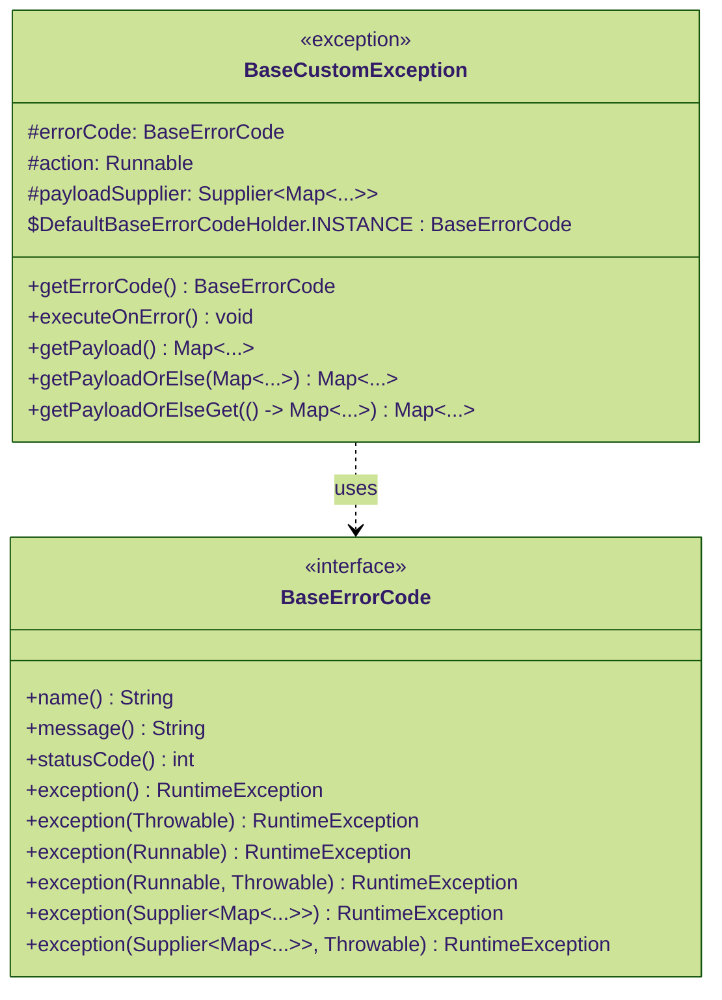
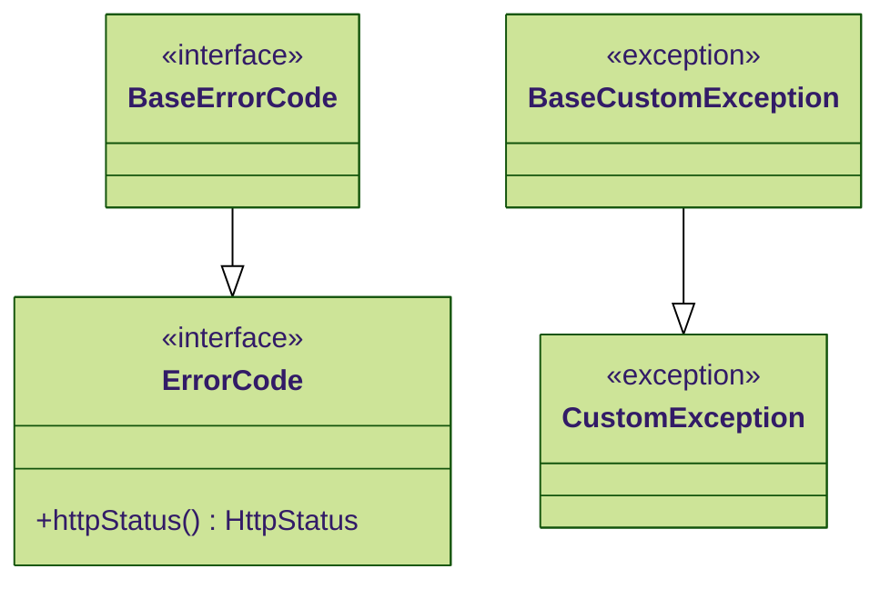

# Download (Maven/Gradle)

**Gradle Script (Kotlin)**

```kotlin
repositories {
    mavenCentral()
    maven { url = uri("https://jitpack.io") } // added
}

dependencies {
    implementation("com.github.merge-simpson:letsdev-error-code-api:0.2.0") // added
}
```

<br />

# Features

이 라이브러리는 다음 기능을 제공합니다.

- 에러코드(인터페이스)
- 커스텀 예외

<details>
  <summary>에러코드 용례</summary>

  ```mermaid
  %%{init: {"theme": "forest", "themeVariables": {"fontFamily": "Comic Sans MS"}}}%%
  classDiagram
  %% class list
      class ErrorCode {
          <<interface>>
      }
      class BoardErrorCode {
          <<enumeration>>
      }
      class SignUpErrorCode {
          <<enumeration>>
      }
      
      ErrorCode <|.. BoardErrorCode : implements
      ErrorCode <|.. SignUpErrorCode : implements
  ```

</details>

<br />

## Pure Java Error Code

- `BaseErrorCode` `<<interface>>`
- `BaseCustomException` `<<exception>>`



## Spring-Dependent Error Code

- `ErrorCode`: `<<interface>>`
- `CustomException` `<<exception>>`

위 목록을 사용하려면 다음 의존성을 포함해야 합니다.  
버전은 자유롭게 선택하십시오.  

|        Group        | Artifact ID | Version |
|:-------------------:|:-----------:|:-------:|
| org.springframework | spring-web  |   any   |

- 각 의존성 라이브러리에서 `org.springframework.http.HttpStatus`를 포함하거나 호환되는 버전이 필요합니다.

<p align="center"><strong>Generalization Relationship</strong></p>



<!--

생성자 목록

%%        +BaseCustomException()
%%        +BaseCustomException(message: String)
%%        +BaseCustomException(message: String, cause: Throwable)
%%        +BaseCustomException(errorCode: BaseErrorCode)
%%        +BaseCustomException(errorCode: BaseErrorCode, cause: Throwable)
%%        +BaseCustomException(errorCode: BaseErrorCode, action: Runnable)
%%        +BaseCustomException(errorCode: BaseErrorCode, action: Runnable, cause: Throwable)
%%        +BaseCustomException(errorCode: BaseErrorCode, payloadSupplier: Supplier&lt;Map&lt;String,Object>>)
%%        +BaseCustomException(errorCode: BaseErrorCode, payloadSupplier: Supplier&lt;Map&lt;String,Object>>, cause: Throwable)

## 확장 가능한 Error Code

- \<\<interface\>\> `ErrorCode` (Spring-dependent)
- \<\<interface\>\> `BaseErrorCode` (independent of other libraries)

`ErrorCode`는 `BaseErrorCode`를 계승합니다. 이것들을 `enum` 클래스에 구현할 수 있습니다. (ex: `enum SignUpErrorCode`)

## 에러코드 핸들링 Custom Exception

- \<\<class\>\> `CustomException` (Spring-dependent)
- \<\<class\>\> `BaseCustomException` (independent of other libraries)

`CustomException`과 `BaseCustomException`은 각각 `ErrorCode`와 `BaseErrorCode`를 핸들링합니다.
하지만 `ErrorCode`가 `BaseErrorCode`를 계승하는 것과 달리, `CustomException`과 `BaseCustomException`은 독립적입니다.  

`CustomException`은 오직 `RuntimeException`을 상속받아 구현하였으며, `HttpStatusCodeException`에도 독립적입니다.
따라서 스프링에서 상태 코드를 변경하여 응답하는 로직은 별도로 구현하여야 합니다. 예를 들어 `@ControllerAdvice`나
`@RestControllerAdvice` 등에서 다음처럼 할 수 있습니다.

```java
@RestControllerAdvice
public final class GlobalExceptionHandler {
    // CustomException과 그것을 상속받은 모든 예외 클래스를 캐치하여 핸들링합니다.
    @ExceptionHandler(CustomException.class)
    public ResponseEntity</* 반환 타입, json object 또는 map 등 */> handleCustomException(CustomException exception) {
        HttpStatus status = exception.defaultHttpStatus();
        // ...
        return ResponseEntity
                .status(status)
                .body(/* 반환할 응답 바디 */);
    }
}
```

# Spring-Dependent

이 라이브러리는 Spring 프레임워크가 없어도 사용할 수 있으며, 다음 목록만 Spring 프레임워크에 의존합니다.

- \<\<interface\>\> `ErrorCode`
- \<\<class\>\> `CustomException`

위 목록을 사용하려면 다음 의존성을 포함해야 합니다.

|        Group        | Artifact ID |
|:-------------------:|:-----------:|
| org.springframework | spring-web  |

-->